# 使用LittleSkin进入原版服的~~妈妈~~保姆级教程

HFUT MC社区的大部分活动和服务器均使用Littleskin登录.

本文介绍了注册Littleskin账号, 以及PCL/HMCL/Prism启动器如何使用Littleskin登录.

> 国内访问加载图片可能会比较慢. 如果图片加载不出来, 请多等等, 或挂梯子.

## 1. 注册LittleSkin账号

[点击进入LittleSkin官网](https://littleskin.cn/)

注册成功后进入仪表盘, 创建自己的角色即可. 角色名字就是游戏名.

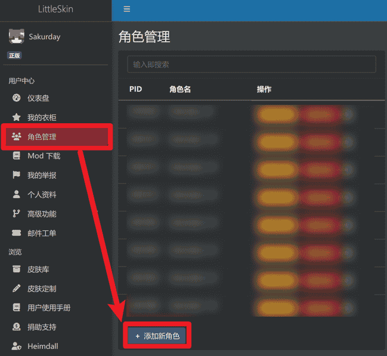

## 2. PCL启动器如何登录

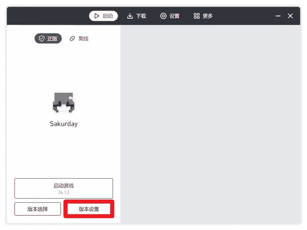

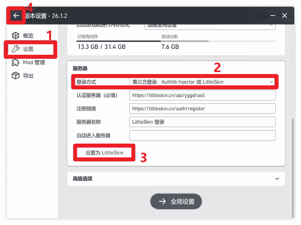

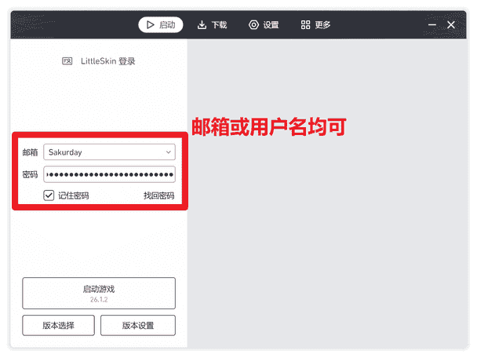

## 3. HMCL启动器如何登录

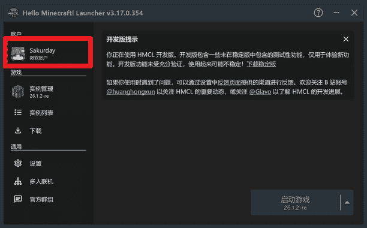

```
https://littleskin.cn/api/yggdrasil
```

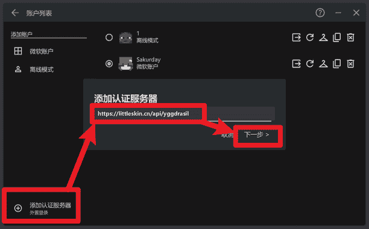

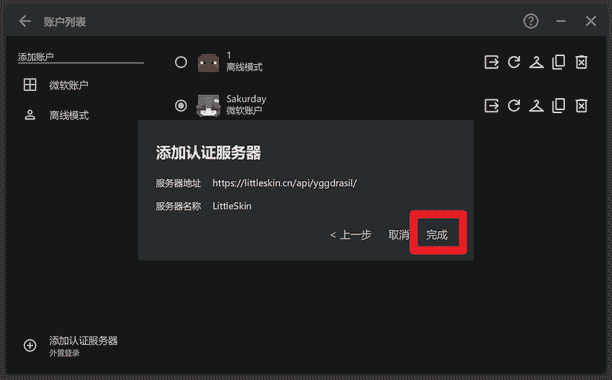

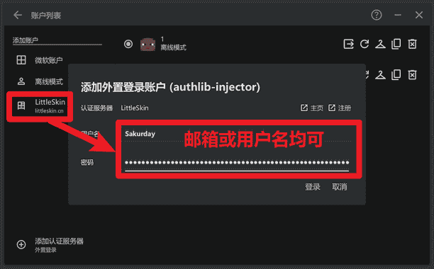

## 4. Prism启动器如何登录

下载模组[Littleskin Switcher](https://github.com/sakurday/LittleSkinSwitcher/releases)并安装

Prism启动器默认只能用正版登录, 保持你的正版登录即可. 接下来启动游戏, 进入多人游戏界面

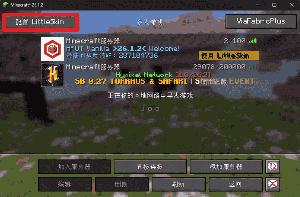

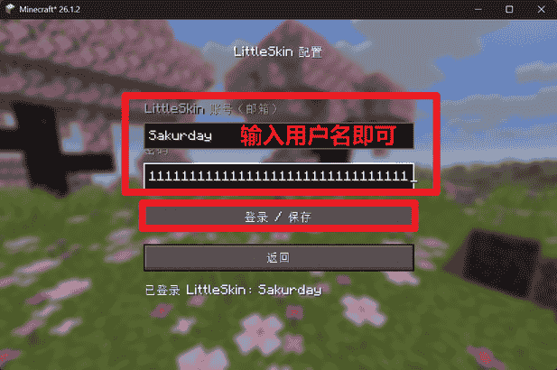

然后点击服务器列表的按钮切换到LittleSkin

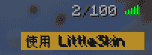

然后进入服务器

此模组由我开发. 如果你发现此模组已经跟不上HFUT原版服的版本了, 请联系我更新. 我不会将模组适配HFUT原版服以外的版本. 如果需要玩其他版本, 请考虑使用PCL或HMCL启动器.