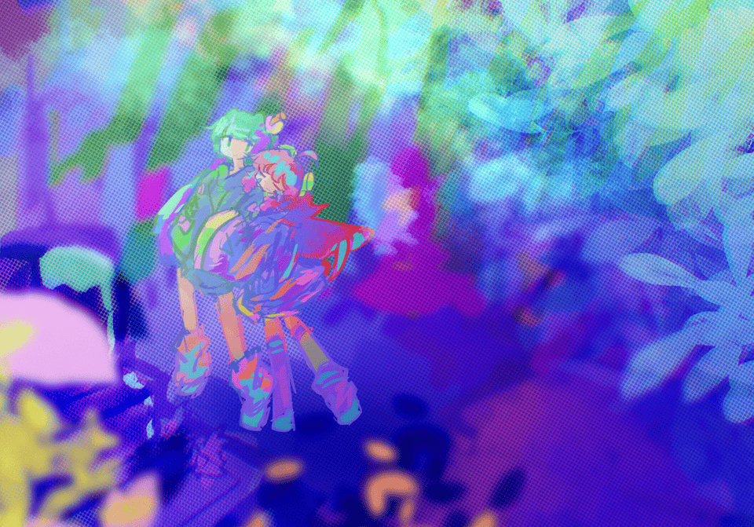

# 追完 Phigros 有感

> 机械蝴蝶飞起, 轻轻落在鸠的手上.

> 鸠陷入了沉默, 豆大泪珠盈满眼眶, 她想起来了, 原来自己再也见不到哥哥了.

> "别哭啊, 我们不是说好了吗?"

> "不管怎么样, 都要好好活下去."

> 哥哥化作数以万计的蝴蝶, 从四面八方飞来. 鸠掌心的蝴蝶, 微微振翅.

---

> "骗子……"

> 房间中，鸠坐在床上，手边的机械蝴蝶振翅欲飞。一张电子早报铺在被子上，头条标隼的笔记本题为“地面探索队遭遇强震，致一死多伤”。

> 泪珠滴落，在光滑的电子纸上晃动，机械蝴蝶却飞走了，鸠急忙穿上鞋，跟着机械蝴蝶奔向门外。

> 她从卧室跑出去，到客厅，到街上。到了门外，机械蝴蝶不知飞去了哪里，唯有喧嚣的日常，向她袭来。

---

> 新郑州的大地上, 高楼林立, 连接天地, 列车道从六面十四方集中在中央车站, 日夜不息.

> 列车连接着无数故事. 鸠默想, 那里会不会有哥哥的故事.

---

> "......"

> "请问......"

> 一道熟悉的声音在耳畔想起, 将鸠拉回现实.

> "这是你的蝴蝶吗"

> 蝴蝶在两人贴紧前便钻了出来, 悠悠飞远; 一串白鸽振翅而起, 掠过镜头, 去向更高, 更高处.

---

## 游戏总结

作为国内少有的非商业剧情音游, Phigros 可谓名扬天下. 如果总分10星, 我会毫不犹豫给 Phigros 打 9 星.

作为一款音游, 他拥有宽容的判定, 所以简单易上手. 同时因为判定线的自由度和 4 种音符的搭配, 使得这个游戏的难度上限非常高.

同时, 他也是优秀的剧情向游戏. 除了最后一章, 游戏全程没有显式剧情, 但是需要从文件破译中将各种零散的剧情拼合起来.

推剧情解锁新歌曲时, 需要解密. 这款游戏的解密非常有意思, 特别是最后一章. 如果去了解具体解密思路, 绝对会为此惊叹.

---

## 2026-10-06 22:04 补

当时是凌晨, 刚推完, 写这篇文章的时候困的不行, 急需睡觉, 所以感受写的有些匆忙. 现在我有时间来好好写一下, 最后一章到底感人在哪

### 新机制与剧情的配合

最后一章引入了"噪域", 所有在噪域内的点击都会被视作无效点击. 粗看, 这个新机制只是为了让游戏变得更难. 但是实际上, 噪域与剧情配合的非常好.

而我认为, 最后一章感人, "噪域" 功不可没

这个新机制首先在 「Petrichor」 中出现, 但是占比很小

但是从 「ハテ」 开始, 这个机制已经和剧情配合的非常好了. 这首歌本身节奏偏混乱阴沉 (Frums 特色了属于是) , 加上噪域遍布整个谱面, 其表现出来的剧情走向已经很明显了: 鸠已经遇到了困难

而在 「Message」 中, 噪域逐渐从屏幕边缘吞噬掉整个屏幕的过程, 配合歌曲本身听起来越来越"轻", 有一股沉入深海的感觉, 提示着鸠发出的信息已经没有了任何回应. 但是后面噪域突然消失, 转而变成类似于"星光"的区域, 说明了鸠已经突破了困难, 歌曲随之变得欢快起来.

新机制, 谱面的表演性和歌曲本身的情感三者配合, 让剧情变得非常感人, 其感人程度远超单单看剧情文字.

---

## 个人感受

很少有游戏能让我哭了

上一个让我哭的游戏是什么呢...

vivid/stasis

同样是一款非商业剧情音游

phigros 与 vivid/stasis

一个为找她的哥哥, 一个为找她的姐姐...

谱面特效结合剧情的完美演出, phigros 和 vivid/stasis 都堪称完美

即使剧情本身略显俗套, 但是作为音游, 一路披荆斩棘锻炼音游技巧, 最后在与剧情完美结合的谱面中听完歌曲, 这就是这类游戏想让我哭的地方.

为什么要把这两个游戏放在一起比较呢

一是我都玩过, 而且都是从未结局时入坑, 一直追到结局

二是这两个游戏都让我哭过

在我心目中, 这两个就是最伟大的游戏!

---

acta est fabula, plaudite

